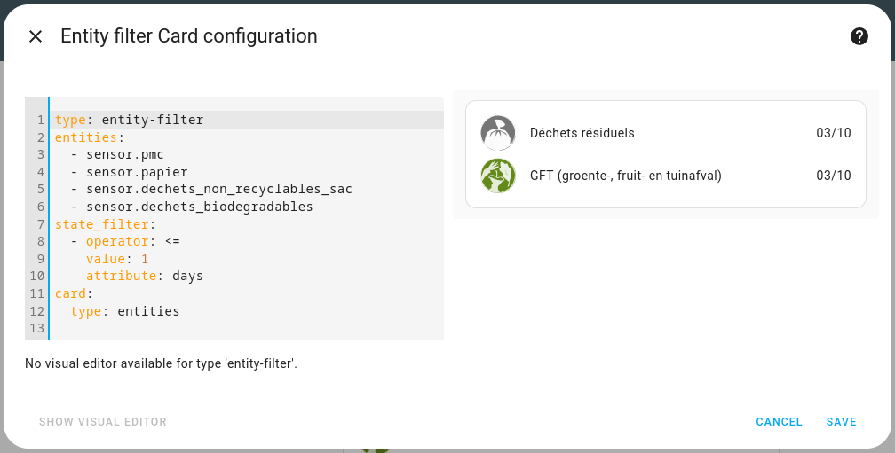
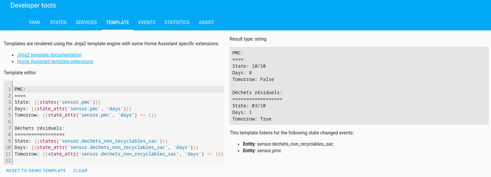
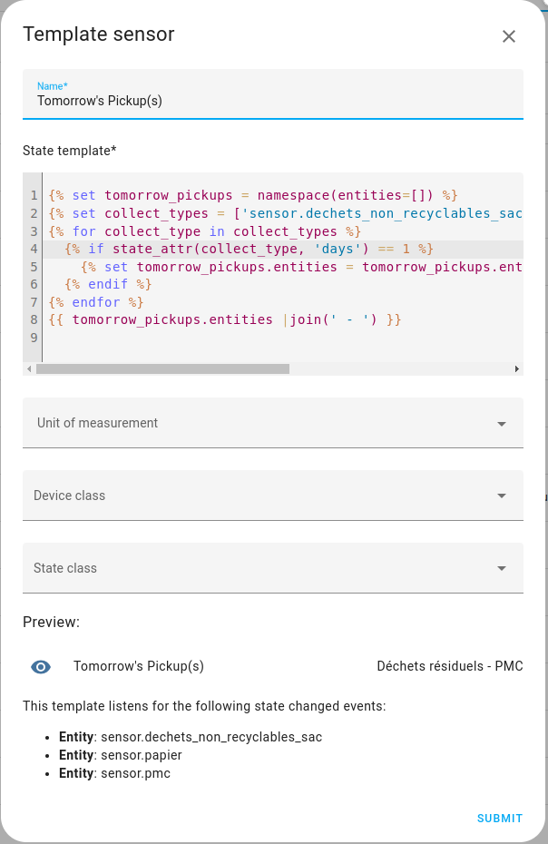

# Home Assistant RecycleApp Integration
[](https://github.com/hacs/integration)
[](https://sonarcloud.io/summary/new_code?id=olibos_HomeAssistant-RecycleApp)

Integrate [RecycleApp](https://recycleapp.be/) into your Home Assistant.

## Installation
* Install HACS Repository:

[](https://my.home-assistant.io/redirect/hacs_repository/?owner=olibos&repository=HomeAssistant-RecycleApp&category=integration)
* Restart Home Assistant
* Install the Integration:

[](https://my.home-assistant.io/redirect/config_flow_start/?domain=recycle_app)
* Complete the setup process:


## Date Format
By default, dates are in Home Assistant date format: %Y-%m-%d

You can customize the format in the `configure` of the device:


The formatting is based on [Python date formatting](https://docs.python.org/3/library/datetime.html#format-codes).

## Usage Samples

### Dashboard with next pickups
With [entity-filter](https://www.home-assistant.io/dashboards/entity-filter/):

```yaml

type: entity-filter
entities:
  - sensor.pmc
  - sensor.papier
  - sensor.dechets_non_recyclables_sac
  - sensor.dechets_biodegradables
state_filter:
  - operator: <=
    value: 1
    attribute: days
card:
  type: entities
```

### Templates


### Tomorrow's Pickup(s)
#### Template helper

#### Code:
```jinja



  
    
  

{{ tomorrow_pickups.entities |join(' - ') }}
```

#### Notification
```yml
alias: Waste collection
description: ""
trigger:
  - platform: time
    at: "19:00:00"
condition:
  - condition: template
    value_template: >-
      falsetrue
action:
  - service: notify.mobile_app_poco_f5
    data:
      message: Tomorrow waste collection of {{states('sensor.tomorrow_s_pickup_s')}}
mode: single
```
Thanks to [@MathiasVandePol](https://github.com/MathiasVandePol) for the sample.

## Bug, ideas?
If some collections are missing, you find a bug or have enhancement ideas don't hesitate to open an [issue](https://github.com/olibos/HomeAssistant-RecycleApp/issues/new).
